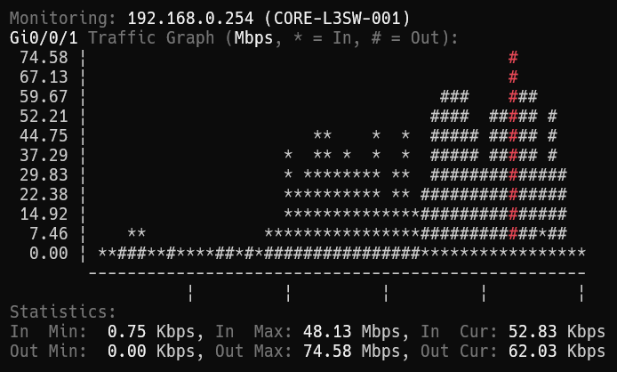
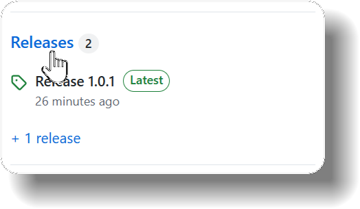
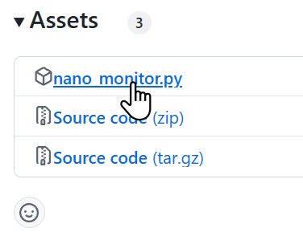

# Nano Monitor



Nano Monitor is a simple and lightweight network monitoring tool built with Python.

## Features

- Ping Monitoring
- HTTP Monitoring
- SNMP Monitoring
- Traffic Monitoring
- Anomaly Detection
- Threshold Detection
- Failure Detection
- Webhook Notifications
- Logging Monitoring Data

## Installation

Before using Nano Monitor, ensure you have Python 3.7 or higher installed.  
For installation instructions, visit the [official Python website](https://www.python.org/downloads/).

1. Click on "Releases" on the right-hand side of the screen.

   

2. Download the "nano_monitor.py"

   

3. Place `nano_monitor.py` in any directory.

    ### To use the Anomaly Detection feature:
    Install the machine learning library `scikit-learn`:

    (Note: The tool can still function without `scikit-learn`, but related features will not be available.)

    ```
    pip install scikit-learn
    ```

    ### To use the HTTP Monitoring features:
    Install `cURL`. However, since `cURL` is pre-installed on many operating systems, please check first by running the command `curl --version`.

   (Note: The tool can still function without `cURL`, but related features will not be available.)

    For Ubuntu or other Debian-based systems:
    ```
    sudo apt install curl
    ```
    For CentOS or other RedHat-based systems:
    ```
    sudo yum install curl
    ```
    For Windows:<br>
    [https://curl.se/](https://curl.se/)

    ### To use the SNMP Monitoring or Traffic Monitoring features:
    Install `Net-SNMP`.

    (Note: The tool can still function without `Net-SNMP`, but related features will not be available.)

    For Ubuntu or other Debian-based systems:
    ```
    sudo apt install snmp
    ```
    For CentOS or other RedHat-based systems:
    ```
    sudo yum install net-snmp net-snmp-utils
    ```
    For Windows:<br>
    [https://sourceforge.net/projects/net-snmp/](https://sourceforge.net/projects/net-snmp/)

## Start-up

1. Navigate to the directory where `nano_monitor.py` is located via CLI.

2. Run `nano_monitor.py` with Python:

   On Linux:
   ```
   python3 nano_monitor.py
   ```

   On Windows:
   ```
   python nano_monitor.py
   ```

3. If the following prompt appears, the startup is successful:

   `Enter the host or URL to monitor:`

4. To exit the tool at any time, press `Ctrl + C` in the command line.

## Usage Example

- Simple Ping monitoring  
`192.168.1.1`

- Simple HTTP monitoring (GET request)  
`https://example.com`

- SNMP monitoring of a specific OID  
`192.168.1.1 --snmp public 1.3.6.1.4.1.2021.11.11.0`

- Traffic monitoring on ifIndex.1  
`192.168.1.1 --snmp public traffic.1`

- Traffic monitoring using ifName (e.g., Gi0/1)  
`192.168.1.1 --snmp public traffic.Gi0/1`

- Ping monitoring with anomaly detection (256 data points, 0.01 contamination)  
`192.168.1.1 --anomaly`

- Ping monitoring with threshold detection  
`192.168.1.1 --thresh >=300`

- Traffic monitoring with threshold detection  
`192.168.1.1 --snmp public traffic.Gi0/1 --thresh in>=1gbps out>=500mbps`

- Ping monitoring with failure and webhook notifications (15-minute suppression interval)  
`192.168.1.1 --fail --webhook https://example.com/webhook 15`

- Ping monitoring with logging (default filename)  
`192.168.1.1 --log`

- Ping monitoring with debugging  
`192.168.1.1 --debug`

## Details of Each Option

Enter any of the following commands to view the help:

`-h`, `--help`, `?`

## Tested Environments

- Python 3.13.0
- Operating Systems:
  - Windows 11
  - Ubuntu 24.04.1 (WSL2)

## License

This project is licensed under the MIT License.  
See the [LICENSE](./LICENSE) file for details.

## Contributing to Nano Monitor

We welcome contributions to improve Nano Monitor!  
Whether it's bug fixes, new features, or documentation updates, your help is greatly appreciated.
