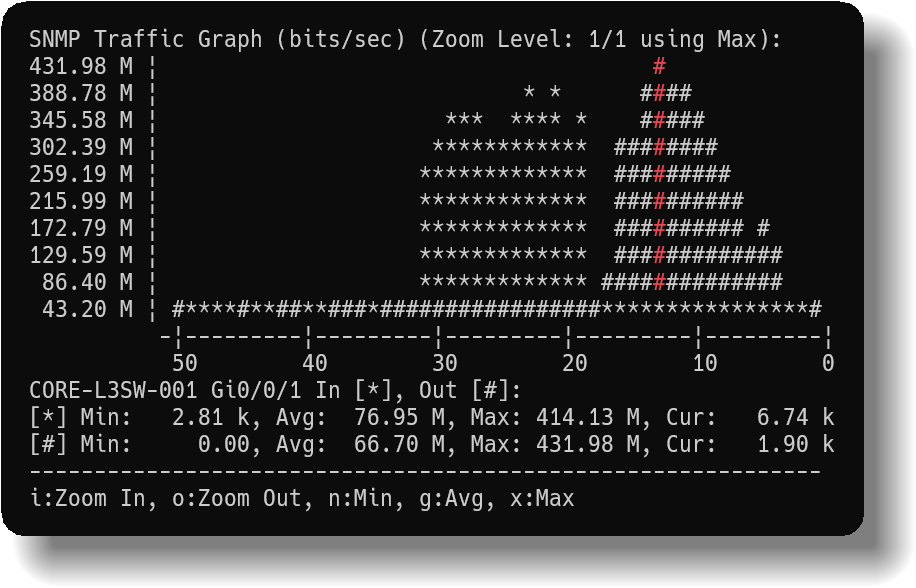
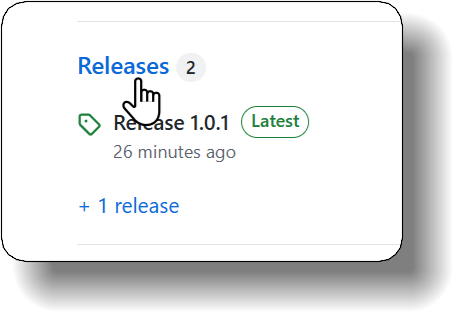
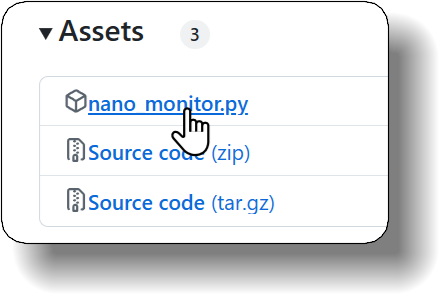

# Nano Monitor



Nano Monitor is a simple and lightweight network monitoring tool built with Python.

## Features

- Ping Monitoring
- HTTP Monitoring
- DNS Monitoring
- SNMP Monitoring
- Traffic Monitoring
- Anomaly Detection
- Threshold Detection
- Webhook Notifications
- Exporting Monitoring Results

## Installation

Before using Nano Monitor, ensure you have Python 3.7 or higher installed.  
Visit the [official Python website](https://www.python.org/downloads/) to install Python.

1. Click the **"Releases"** tab on the right-hand side of [the page](https://github.com/RyojiSeto/nano-monitor/).

   

2. Download "nano_monitor.py"

   

3. Move `nano_monitor.py` to any directory.

    ### To use the Anomaly Detection feature:
    Install the machine learning library `scikit-learn`:

    *Note: The tool will still work without `scikit-learn`, but anomaly detection features will be unavailable.*

    ```
    pip install scikit-learn
    ```

    ### To use the HTTP Monitoring features:
    Install `cURL`. Since `cURL` is pre-installed on most operating systems, check if it's already installed by running:
    ```
    curl --version
    ```

    *Note: The tool will still work without `cURL`, but HTTP Monitoring features will be unavailable.*

    For Ubuntu or other Debian-based systems:
    ```
    sudo apt install curl
    ```
    For CentOS or other RedHat-based systems:
    ```
    sudo yum install curl
    ```
    For Windows:  
    [https://curl.se/](https://curl.se/)

    ### To use the DNS Monitoring features:
    Install `BIND Utilities`. Since `BIND Utilities` are pre-installed on most operating systems, check if it's already installed by running:
    ```
    dig -v
    ```

    *Note: The tool will still work without `BIND Utilities`, but DNS Monitoring features will be unavailable.*

    For Ubuntu or other Debian-based systems:
    ```
    sudo apt install dnsutils
    ```
    For CentOS or other RedHat-based systems:
    ```
    sudo yum install bind-utils
    ```
    For Windows:  
    Unfortunately, it seems that BIND is no longer supported on Windows as of version 9.18.  
    [https://www.isc.org/bind/](https://www.isc.org/bind/)

    ### To use the SNMP Monitoring or Traffic Monitoring features:
    Install `Net-SNMP`.

    *Note: The tool will still work without `Net-SNMP`, but SNMP Monitoring and Traffic Monitoring features will be unavailable.*

    For Ubuntu or other Debian-based systems:
    ```
    sudo apt install snmp
    ```
    For CentOS or other RedHat-based systems:
    ```
    sudo yum install net-snmp net-snmp-utils
    ```
    For Windows:  
    [https://sourceforge.net/projects/net-snmp/](https://sourceforge.net/projects/net-snmp/)

    If you're unsure whether Net-SNMP is installed, you can check by running:
    ```
    snmpget -V
    ```

## Usage Example

The following examples assume you run the command as:
```  
python nano_monitor.py [options]
```  
To keep the examples concise, `python nano_monitor.py` is omitted.

### Basic Usage

- Ping Response Time Monitoring  
`--ping 192.168.1.1`

- HTTP Response Time Monitoring  
`--http https://example.com`

- DNS Resolution Time Monitoring  
`--dns example.com`

- SNMP Monitoring  
`--snmp 192.168.1.1 --community public --oid .1.3.6.1.4.1.2021.11.11.0`

- Traffic Monitoring Using ifIndex  
`--traffic 192.168.1.1 --community public --interface 2`

- Traffic Monitoring Using ifName  
`--traffic 192.168.1.1 --community public --interface eth0`

### Useful Options & Examples

- Monitoring Up to Two Hosts  
`--ping 192.168.1.1 192.168.1.2`

- Setting Threshold Values  
`--ping 192.168.1.1 192.168.1.2 --threshold 100 200`

- Enabling Anomaly Detection  
`--ping 192.168.1.1 --anomaly`

- Sending Alerts via Webhook  
`--ping 192.168.1.1 --webhook https://hooks.example.com/XXX`

- Saving Results to CSV  
`--ping 192.168.1.1 --csv`

- Setting the Monitoring Interval (in Seconds)  
`--ping 192.168.1.1 --interval 0.5`

- Setting Timeout Values (in Seconds)  
`--ping 192.168.1.1 --timeout 3`

### Advanced Settings & Customization

- Setting Packet Sizes (Ping Monitoring Option)  
`--ping 192.168.1.1 --packet-size 64`

- Setting Source IP Addresses (Ping Monitoring Option)  
`--ping 192.168.1.1 --source 192.168.1.2`

- Setting IP Versions (Ping Monitoring Option)  
`--ping example.com --ipv 4`

- Setting DNS Servers (DNS Monitoring Option)  
`--dns example.com --dns-server 192.168.1.1`

- Enabling Millisecond Precision in CSV Logs  
`--ping 192.168.1.1 --csv-ms`

- Setting an Execution Timeout (in Seconds)  
`--ping 192.168.1.1 --exec-timeout 6`

- Setting Threshold Values for Lower Limits  
`--ping 192.168.1.1 --threshold "<100"`

- Setting Anomaly Detection Parameters  
`--ping 192.168.1.1 --anomaly --samples 512 --contamination 0.05`

- Setting Graph Display Size  
`--ping 192.168.1.1 --graph-width 100 --graph-height 20`

- Setting a Fixed Y-Axis Scale  
`--ping 192.168.1.1 --y-scale 200`

- Setting Graph Symbols  
`--ping 192.168.1.1 --graph-symbol "@"`

- Setting Data Retention  
`--ping 192.168.1.1 --keep-data 10000`

## Details of Each Option

Run any of the following commands to display the help menu:

`-h`, `--help`

## Tested Environments

- Python 3.13.0
- Operating Systems:
  - Windows 11
  - Ubuntu 24.04.1 (WSL2)

## License

This project is licensed under the MIT License.  
See the [LICENSE](./LICENSE) file for details.

## Contributing to Nano Monitor

We welcome contributions to improve Nano Monitor!   
Whether it's bug fixes, new features, or documentation updates, your help is greatly appreciated.


<!-- Google Search Console verification -->
<meta name="google-site-verification" content="bGaObD2jjXsHgJzkxF8HJ4CgKug16GQmhIO4tDs4EBs" />
